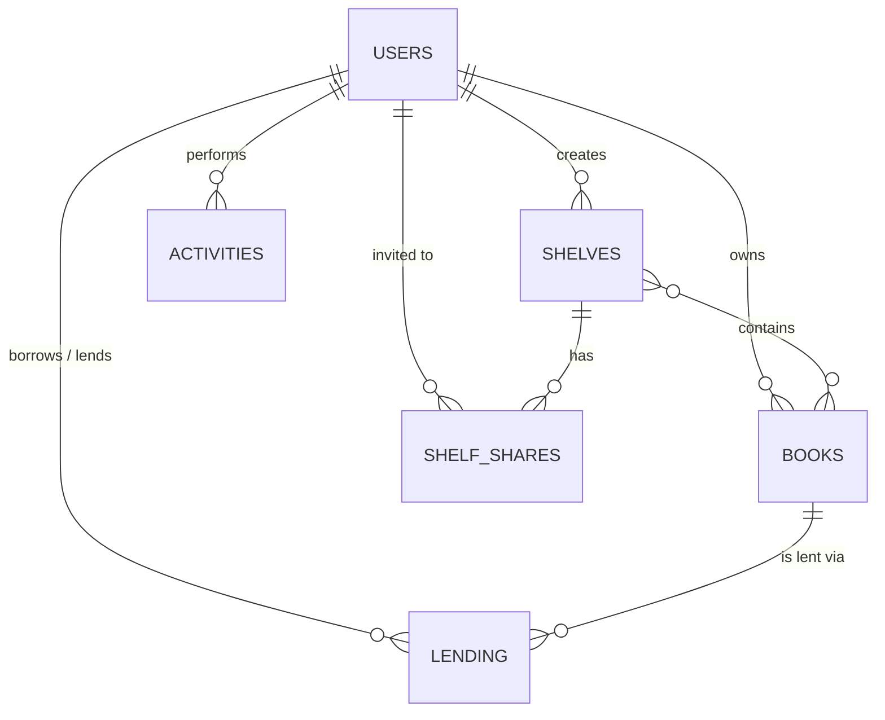

# Booknest

Booknest is a modern, collaborative personal library management application. It allows users to track their reading progress, organize books into custom shelves, share those shelves with friends using granular permissions (Viewer or Editor), and even lend books to other users. Real-time updates ensure that when a friend adds a book to a shared shelf or returns a lent book, your dashboard updates instantly without refreshing the page.

---

## How to Run It (Clean-Clone Tested)

### Prerequisites
- Python 3.9+
- Node.js 18+
- PostgreSQL

### 1. Database Setup
Ensure PostgreSQL is running and create a database named `booknest`.
```bash
createdb booknest
```

### 2. Backend Setup
Navigate to the `backend/` directory, set up your environment, and start the API server.
```bash
cd backend
python3 -m venv venv
source venv/bin/activate
pip install .
```
Start the FastAPI server:
```bash
uvicorn app.main:app --reload
```
The backend will be available at `http://127.0.0.1:8000`. Database tables are automatically created on startup.

### 3. Frontend Setup
Navigate to the `frontend/` directory, configure the environment, and start the Vite dev server.
```bash
cd frontend
npm install
cp .env.example .env
npm run dev
```
The frontend will be available at `http://localhost:5173`.

---

## Data Model

The application revolves around six core entities:

* **Users**: The core identity. Has many Books, Shelves, and Activities.
* **Books**: A book belonging to a User. Tracks metadata (title, author) and reading progress (status, current page).
* **Shelves**: A collection of Books belonging to an Owner (User). 
* **ShelfShares**: A junction table enabling many-to-many relationships between Shelves and Users. Contains a `role` enum (`viewer` or `editor`).
* **Lending**: Tracks the state of a book borrowed by another User. Contains `lender_id`, `borrower_id`, and status flags.
* **Activities**: An append-only audit log tracking major events (e.g., "Returned a book", "Added book to shelf").

### Relationships Diagram


---

## Stack Choice & Justification

**Backend: FastAPI & PostgreSQL**
FastAPI was chosen for its massive performance benefits, built-in async support (critical for WebSockets), and seamless Pydantic validation. PostgreSQL was chosen for its strict relational integrity, which is necessary when handling complex sharing and lending permissions.

**Frontend: React, Vite & React Query**
React (bootstrapped with Vite for speed) provides a modular UI architecture. `React Query` was strictly utilized to handle server-state caching. Instead of manually managing `useEffect` hooks to fetch books, React Query handles caching, background refetching, and cache invalidation upon successful API mutations.

**Styling: Custom CSS (Glassmorphism & Dark Mode)**
To achieve a premium, Notion-inspired aesthetic, the app uses vanilla CSS with CSS variables for strict design token enforcement, enabling vibrant hover micro-animations and a sleek dark theme.

---

## Refresh-Token Flow

1. **Storage**: On login, the backend returns an `access_token` and `refresh_token`. The frontend stores the `access_token` in memory/localStorage. 
2. **Usage**: An Axios Request Interceptor automatically attaches `Authorization: Bearer <access_token>` to all outgoing API requests.
3. **Expiry (The Silent Refresh)**: When the `access_token` expires, the backend throws a `401 Unauthorized`. 
4. **Interception**: The Axios Response Interceptor catches this `401` error globally. It pauses all outgoing requests, sends the `refresh_token` to the `/refresh` endpoint to receive a new access token, updates localStorage, and silently replays the paused requests. The user never experiences a session interruption.

---

## Shelf Roles Enforcement

Permissions are strictly enforced on the backend via SQLAlchemy query validation.
- **Owner**: Only the shelf owner (verified by comparing `current_user.id` against `Shelf.owner_id`) can delete the shelf, share it, or modify collaborator roles.
- **Editor/Viewer**: If a user attempts to add/remove a book from a shelf, the backend checks `ShelfShare`. If the role is `viewer`, a `403 Forbidden` is raised. 

If a malicious actor tries to bypass the UI and hit `DELETE /shelves/{id}/books/{book_id}` directly via Postman, the backend validates their JWT, checks the database for their `ShelfShare` role, and firmly rejects the request with a `403`.

---

## WebSocket Setup

1. **Authentication**: WebSockets cannot rely on HTTP Authorization headers natively in browser APIs. Instead, the frontend connects by appending the JWT as a query parameter: `ws://.../ws?token=<token>`. The backend validates this token before accepting the connection.
2. **Targeted Delivery**: The backend `ConnectionManager` maps the active WebSocket connection to the user's explicit `user_id`. To ensure a user only receives events meant for them (their own events plus updates on shelves shared with them), the backend explicitly iterates over the relevant user IDs. For example, when a shared shelf is updated, the backend queries all collaborators (editors and viewers) and dispatches `send_personal_message` exclusively to those specific sockets.
3. **Disconnects/Reconnects**: If the server restarts or connection drops, the `ws.onclose` event triggers an exponential backoff algorithm in React, attempting to reconnect gracefully (1s, 2s, 4s...) until successful. Once reconnected, React Query automatically invalidates stale caches to fetch missed events.

---

## Challenges & Resolutions

**Case Sensitivity Bug in Lending & Sharing**
During testing, sharing shelves occasionally failed with a cryptic `404 User Not Found`. It turned out that `Pydantic` does not automatically lowercase `EmailStr`. A user who signed up with `MyEmail@example.com` was saved in mixed-case in PostgreSQL. However, the sharing API converted emails to lowercase before querying, resulting in a mismatch.
**Resolution**: I audited the entire authentication flow and added strict normalization (`.lower().strip()`) at the boundaries (Signup, Login, Sharing, Lending) to guarantee data integrity across the system.

---

## Known Issues
- Real-time WebSocket events for *shelf modifications* by collaborators are currently broadcasted efficiently, but if two editors rapidly add books to the exact same shelf simultaneously, there is a minor race condition on the frontend cache invalidation that could result in a visual duplicate until the next hard refresh.

## Future Improvements
- **Pagination**: Implement cursor-based pagination for the Activity feed, as the current implementation fetches the latest 50 events, which won't scale infinitely.
- **Email Notifications**: Integrate a background worker (e.g., Celery) to send physical emails when someone shares a shelf with you.

---

## AI Usage

I utilized AI to accelerate development in two specific areas:
1. **Frontend Styling**: I prompted the AI to assist with the UI changes and styling of the components. The AI effectively generated the custom CSS properties and grid layouts. I learned how heavily relying on CSS root variables makes design updates vastly more predictable.
2. **Backend API Testing**: I instructed the AI to generate a comprehensive Pytest integration suite using FastAPI's `TestClient`. I explicitly constrained the AI to avoid hardcoded URLs. Observing the generated test suite taught me how to properly use dependency injection and fixtures to simulate multi-user lending flows entirely in-memory without hitting an actual network layer.
